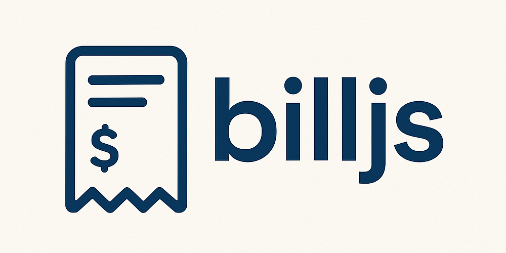

# **billjs**

A comprehensive TypeScript billing engine for invoices, receipts, and point-of-sale systems. Features an immutable API, plugin system, and support for complex billing scenarios including multi-currency, tiered discounts, addons/variations, and flexible tax rules.

📚 **[Full Documentation](https://github.com/aburaihan/billjs/tree/master/docs)**

---

## **✨ Features**

* **Immutable API**: All operations return new instances without mutating the original bill
* **Plugin System**: Extensible with custom plugins for loyalty points, regional taxes, promo codes, etc.
* **Complex Calculations**: Support for addons, variations, tiered discounts, compound taxes, and inclusive/exclusive taxes
* **Multi-Currency**: Exchange rate support for international billing
* **Type Safety**: Full TypeScript support with comprehensive type definitions
* **Precision Handling**: Uses Decimal.js for accurate financial calculations

---

## **🚀 Installation**

```bash
npm install billjs
```

## **📖 Quick Start**

```typescript
import { createBill, addItem, addTaxRule, calculateTotal, pipe } from "billjs";
```

---

## **🧾 Concepts**

### **Bill Context**

The bill context holds all billing data and is immutable:

```typescript
interface BillContext {
  items: BillItem[];
  discounts: Discount[];
  taxes: TaxRule[];
  config: BillConfig;
  plugins: BillPlugin[];
  meta: Record<string, any>;
}
```

### **Items**

Items can have addons and variations, and support item-level discounts:

```typescript
interface BillItem {
  id: string;
  name: string;
  qty: number;
  unitPrice: number;
  addons?: BillItem[]; // Additional items per unit
  variations?: BillItem[]; // Variations per unit
  discounts?: Discount[]; // Item-level discounts
}
```

### **Discounts**

Three types of discounts: percent, fixed, and tiered:

```typescript
interface Discount {
  id: string;
  type: "PERCENT" | "FIXED" | "TIERED";
  value?: number; // For PERCENT and FIXED
  tiers?: { minSubtotal: number; rate: number }[]; // For TIERED
}
```

### **Taxes**

Flexible tax rules with inclusive/exclusive and compound options:

```typescript
interface TaxRule {
  name: string;
  rate: number;
  applyOn?: "subtotal" | "taxableBase"; // Where to apply
  inclusive?: boolean; // True if price includes tax
  compound?: boolean; // Apply on base + previous taxes
}
```

---

## **🌍 Advanced Features**

### Addons and Variations

Items can have nested addons and variations:

```typescript
const bill = addItem(createBill({ currency: "USD" }), {
  id: "pizza",
  name: "Pizza",
  qty: 2,
  unitPrice: 10,
  addons: [
    { id: "cheese", name: "Extra Cheese", qty: 1, unitPrice: 2 }
  ],
  variations: [
    { id: "size", name: "Large", qty: 1, unitPrice: 3 }
  ]
});
// Total per pizza: 10 + 2 + 3 = 15, for 2 pizzas: 30
```

### Tiered Discounts

Discounts that scale with subtotal:

```typescript
const discount: Discount = {
  id: "bulk",
  type: "TIERED",
  tiers: [
    { minSubtotal: 0, rate: 0 },
    { minSubtotal: 1000, rate: 5 },
    { minSubtotal: 2000, rate: 10 }
  ]
};
// 5% off on $1500 subtotal, 10% off on $2500
```

### Compound Taxes

Taxes applied on top of other taxes:

```typescript
const bill = pipe(
  createBill({ currency: "USD" }),
  (b) => addItem(b, { id: "item", name: "Item", qty: 1, unitPrice: 100 }),
  (b) => addTaxRule(b, { name: "GST", rate: 5 }),
  (b) => addTaxRule(b, { name: "PST", rate: 8, compound: true })
  // PST applied on 100 + 5 = 105, total tax = 5 + 8.4 = 13.4
);
```

### Multi-Currency

```typescript
const result = pipe(
  createBill({ currency: "EUR", exchangeRate: 1.1 }),
  (b) => addItem(b, { id: "item", name: "Item", qty: 1, unitPrice: 100 }),
  calculateTotal
);
// Total in EUR: 100 * 1.1 = 110
```

### Plugins

Extend functionality with plugins:

```typescript
import { loyaltyPointsPlugin } from "billjs/plugins";
```

---

## **📊 Example Scenario**

**Electronics shop invoice:**

* Items: Laptop (10% off), Mouse ×2.

* Taxes: GST @18%.

Result breakdown:

* Subtotal: 1100

* Discounts: 100

* Taxes: 180

* **Final Total: 1180**

---

## **📌 Output Example**

```json
{
  "subtotal": 1100,
  "discounts": 100,
  "taxes": 180,
  "total": 1180,
  "breakdown": {
    "items": [
      { "id": "laptop", "name": "Laptop", "total": 900 },
      { "id": "mouse", "name": "Mouse", "total": 100 }
    ],
    "taxBreakdown": [
      { "name": "GST", "rate": 18, "amount": 180 }
    ],
    "discountBreakdown": [
      { "id": "promo", "type": "PERCENT", "amount": 100 }
    ]
  },
  "meta": {}
}
```

---

## **🛠️ Use Cases**

* Invoices & receipts.

* POS and e-commerce checkout systems.

* SaaS billing & subscription breakdowns.

* Accounting and tax compliance.